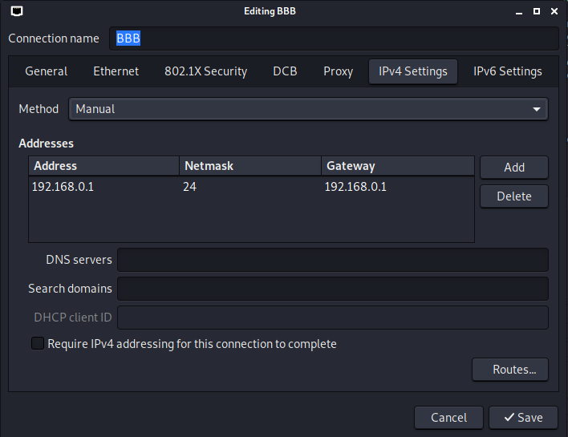

# LAB 1: BOARD SETUP #

## Set up TFTP
In order to interact with Uboot, the board need to be reset and we need to press
SPACE.

Then, first step is to clear U-Boot environment variables to avoid trouble
because of settings applied in other labs.
```
env default -f -a   -> reset environment variable to default
saveenv             -> save environment variable
```
We can follow the steps in bootlin training lab. However, I don't have a USB
cable to connect with my Beaglebone, so let's use the ethernet cable.
Intertestingly, if you checkout U-Boot help, you can see that we can plug
the beaglebone black to a router and use dhcp option in order to set up tftp.
Anyway, let's set up the network with an ethernet cable. 
```
setenv ipaddr 192.168.0.100
setenv serverip 192.168.0.1
```
And we need to configure also the ip address on our host machine to 192.168.0.1
Run the following command on the terminal
```
nm-connection-editor
```
Then edit the ethernet connection as the following figure


Now we can ping our host computer from U-Boot
```
=> ping 192.168.0.1
link up on port 0, speed 100, full duplex
Using cpsw device
host 192.168.0.1 is alive
```
And we can set up the tftp server to transfer file. Remember to change the
TFTP_DIRECTORY in /etc/default/tftpd-hpa to a directory without the need of root
permission. Then create a "textfile.txt" in that folder. 
```
=> tftp 0x81000000 textfile.txt
link up on port 0, speed 100, full duplex
Using cpsw device
TFTP from server 192.168.0.1; our IP address is 192.168.0.100
Filename 'textfile.txt'.
Load address: 0x81000000
Loading: #
         0 Bytes/s
         done
         => md 0x81000000
         81000000: 00000000 00000000 00000000 00000000    ................
         81000010: 00000000 00000000 00000000 00000000    ................
         81000020: 00000000 00000000 00000000 00000000    ................
         81000030: 00000000 00000000 00000000 00000000    ................
         81000040: 00000000 00000000 00000000 00000000    ................
         81000050: 00000000 00000000 00000000 00000000    ................
         81000060: 00000000 00000000 00000000 00000000    ................
         81000070: 00000000 00000000 00000000 00000000    ................
         81000080: 00000000 00000000 00000000 00000000    ................
         81000090: 00000000 00000000 00000000 00000000    ................
         810000a0: 00000000 00000000 00000000 00000000    ................
         810000b0: 00000000 00000000 00000000 00000000    ................
         810000c0: 00000000 00000000 00000000 00000000    ................
         810000d0: 00000000 00000000 00000000 00000000    ................
         810000e0: 00000000 00000000 00000000 00000000    ................
         810000f0: 00000000 00000000 00000000 00000000    ................
         => 
```

