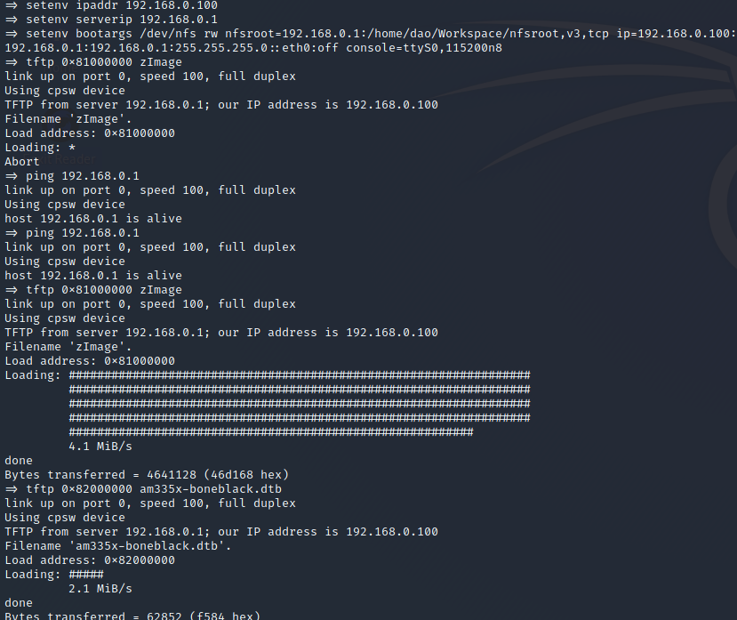
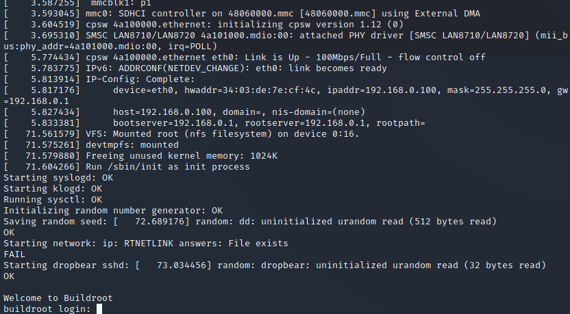

# LAB 2: KERNEL COMPILING AND BOOTING #

In this lab, we will need to configure and compile the kernel. Then, we will use
the rootfile system provided in the lab tar file to boot the system.

## Kernel Compiling ##
Since we are using beaglebone black, we need to create a configuration file from
omap2plus_defconfig.
```
make ARCH=arm omap2plus_defconfig
```
Then, we need to add other config in the default config
```
CONFIG_USB_GADGET=y
CONFIG_USB_MUSB_HDRC=y     -> driver for the USB OTG controller
CONFIG_USB_MUSB_GADGET=y   -> use the USB OTG controller in device (gadget) mode
CONFIG_USB_MUSB_DSPS=y
CONFIG_AM335X_PHY_USBS=y
CONFIG_USB_ETH=y
CONFIG_ROOT_NFS=y          -> support booting on an NFS exported root directory
```
Now, let's compile the kernel.
```
make ARCH=arm CROSS_COMPILE=arm-linux_gnueabi- zImage -j4

make ARCH=arm CROSS_COMPILE=arm-linux_gnueabi- dtbs -j4
```
In the meanwhile of waiting for the kernel to be compiled, we can set up the NFS
server.
```
sudo apt install nfs-kernel-server
```

And modify the NFS directory to the directory of the rootfile system that we
want to expose to the beaglebone.
```
sudo vim /etc/exports

```
and add the following line
```
/absolute/path/to/root/file/system 192.168.0.100(rw,no_root_squash,no_subtree_check)
```
with 192.168.0.100 is the ip address of the beaglebone that we configure by
setting the U-Boot environment variable from the lab1. After this setting, we
need to restart the NFS server.
```
sudo /etc/init.d/nfs-kernel-server restart
```
When the compiled kernel is finished. Copy kernel zImage and 
am335x-boneblack.dtb to tftp home directory. The kernel image stays in
$(LINUX_KERNEL_DIRECTORY)/arch/arm/boot and the compiled device tree binary is
in $(LINUX_KERNEL_DIRECTORY)/arch/arm/boot/dts.

Now let's get back to U-Boot and configure the environment variable.
```

# set ip address for beaglebone
setenv ipaddr 192.168.0.100   

# set host ip address
setenv serverip 192.168.0.1 


# set up nfs server and transfer data via ethernet
setenv bootargs root=/dev/nfs rw nfsroot=192.168.0.1:/home/dao/Workspace/nfsroot,v3,tcp ip=192.168.0.100:192.168.0.1:192.168.0.1:255.255.255.0::eth0:off console=ttyS0,115200n8


# copy the kernel and dtb in RAM
tftp 0x81000000 zImage
tftp 0x82000000 am335x-boneblack.dtb


# boot the image without initramfs
bootz 0x81000000 - 0x82000000
```


If you have trouble with tftp server and nfs, just restart the services

```
sudo /etc/init.d/tftpd-hpa restart

sudo /etc/init.d/nfs-kernel-server restart
```



