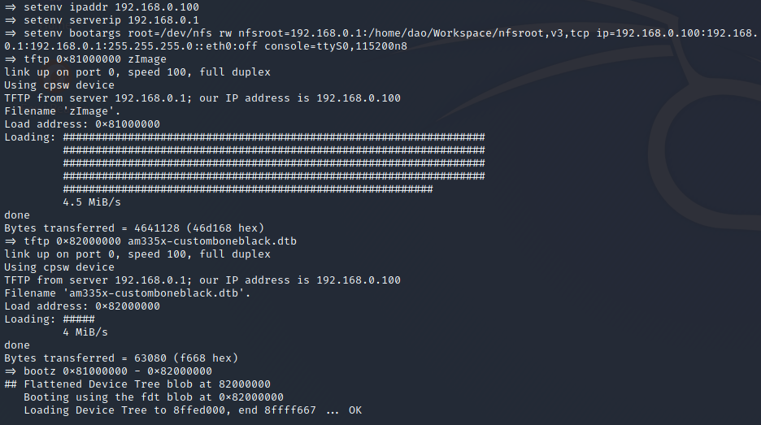
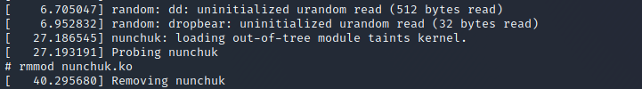

# LAB 4: Device Model: I2C Device #

First step, we need to enable i2c1 from the device tree in
am335x-custome-bone-common.dtsi 
```
i2c1_pins: pinmux_i2c1_pins {
	pinctrl-single,pins = <
		AM33XX_PADCONF(AM335X_PIN_SPI0_CS0, PIN_INPUT_PULLUP, MUX_MODE2)
		AM33XX_PADCONF(AM335X_PIN_SPI0_D1, PIN_INPUT_PULLUP, MUX_MODE2)
	>;
};

&i2c1 {
	pinctrl-names = "default";
	pinctrl-0 = <&i2c1_pins>;

	status = "okay";
	clock-frequency = <100000>;

	joystick: joystick@52 {
		compatible = "nintendo,nunchuk";
		reg = <0x52>;
		#address-cells = <1>;
		#size-cells = <1>;
	};
};
```

then, we can move the new dtb to our tftp home directory to transfer to the beagelbone.



After that, we can check the status of i2c1 


and the dump driver




